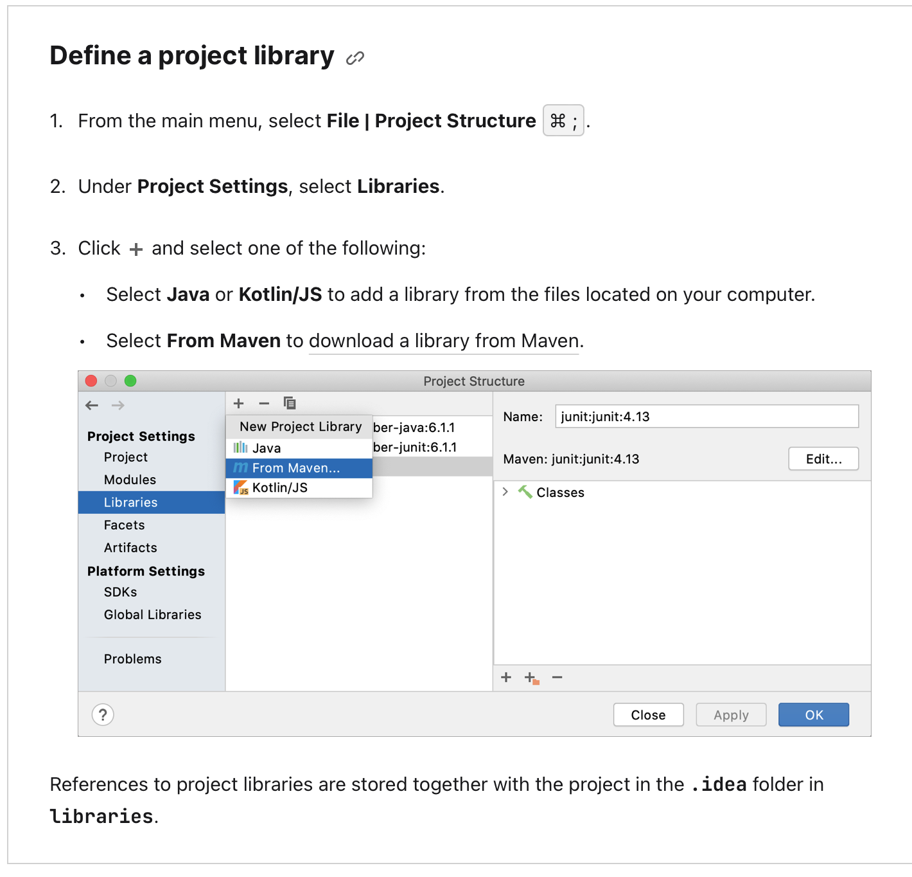

## README for JSON Reader/Writer

### PLEASE READ:
You may need to add a missing dependency before you're able to run the JSON_Reader and Writer code. I've uploaded json-simple-1.1.jar to the repo, so please add that as a Library dependency. Instructions on how to do so may differ from IDE to IDE, but I'll be posting the one from IntelliJ since it's pretty clear on what you need to do in general IMO.

### JSON File Attributes for JSON_Reader/Writer
> {"**credentials**": [{"**website**": "example.com", "**loginfo**"={"**username**": "user", "**password**": "word"}}, ...]

### JSON_Reader
JSON_Reader reads the contents of a JSON_file with attributes as listed above. You can call it once you declare and initialize an instance of a JSON_Reader object with
>JSON_Reader jr = new JSON_Reader()

Once you do this, you can call its read(String fileName) method to read the JSON specified. Keep in mind that this returns an ArrayList for ease of data access. 

For example, if our intended filename is 'creds.json', we can call the read method as 
> ArrayList ar = jr.read("creds.json");

One more thing, the structure of the ArrayList it outputs is as follows:

Inside each index, there is a String array of size 3 holding each website's credentials and information. The String[] in each index's structure is as follows:
> - index 0: website url
> - index 1: username
> - index 2: password

### JSON_Writer
JSON_Writer writes the contents of a JSON object to a file based on the specification listed above. You can also call this class once you declare and initialize an instance of JSON_Writer with
> JSON_Writer jw = new JSON_Writer();

Once a JSON_Writer object instance has been created, you have three  options for methods.

1. Add object to JSONArray
   - Either through pre-built JSON with same field names as specification, or through providing the website name, username, password, and salt.
     > addEntry(String website, String username, String password)
     OR
     addEntry(JSONObject jso)
2. Remove Object from JSONArray
   > remove(JSONObject jso)
4. Export file
	- If you're trying to export the JSON file to a file called "creds.json," an appropriate call to this method is:
	   > jw.export("creds");

